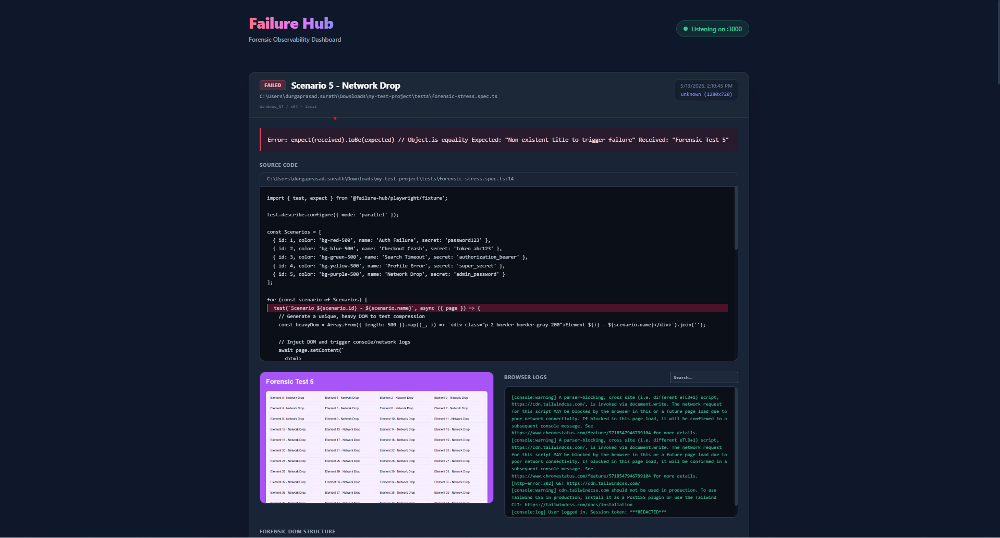
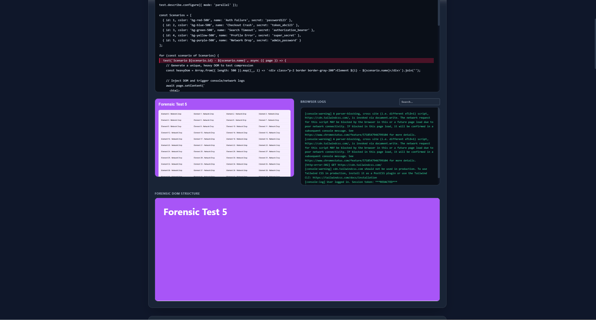
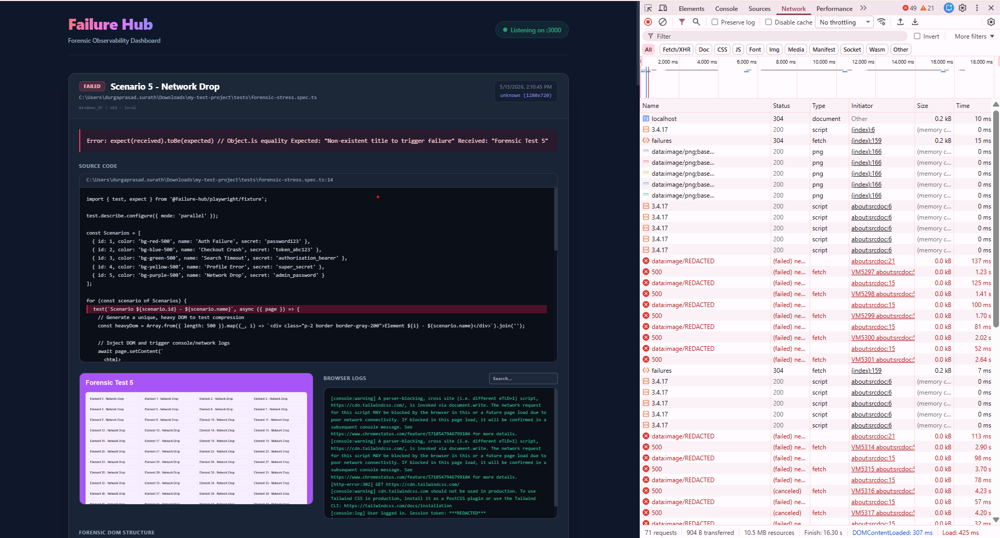
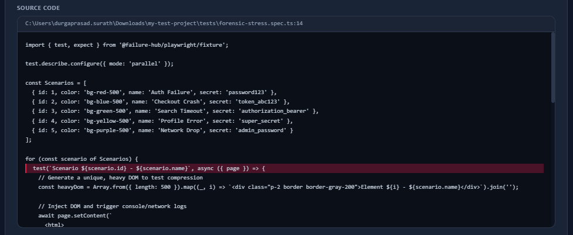
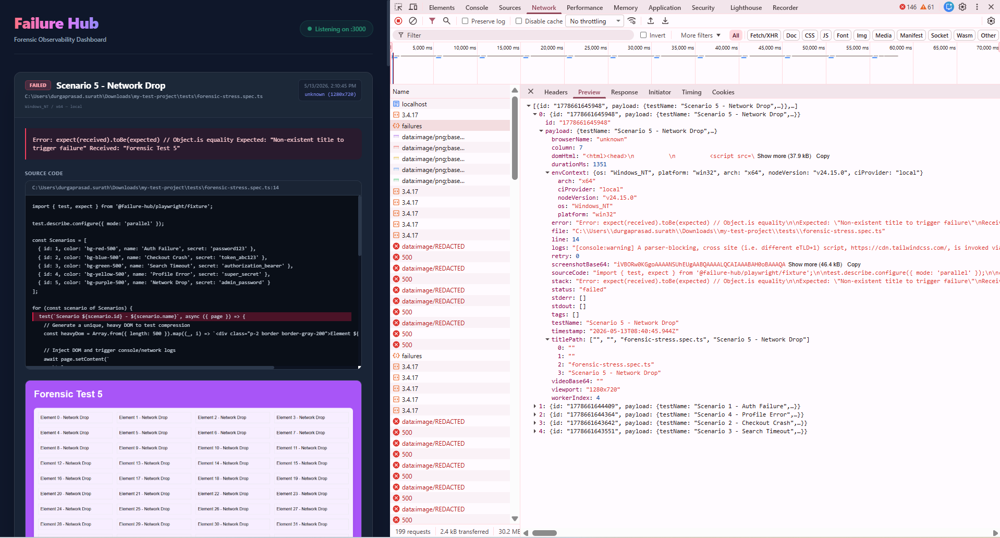

# Failure Hub Playwright
# Forensic observability framework for Playwright.

> A high-performance, forensic observability framework for Playwright that streams Gzipped crash data to a real-time dashboard.

---

## 🎥 Visual Tour

<div align="center">
  
  <p><em>Real-time streaming of Gzipped forensic payloads directly from the test runner.</em></p>
</div>

### 1. Dashboard Home (Failure Cards & Timelines)


### 2. Forensic DOM Viewer


### 3. Browser Console Logs & Network Errors


### 4. Source Code Highlighting


### 5. Raw Payload Viewer


---

## 1. System Overview (The "Why")

Traditional test reporters often rely on slow, bulky file uploads (like full traces or videos) that can easily overwhelm orchestration layers and networks during high-concurrency failure events. We engineered a better way.

**The Forensic Architecture**
We moved away from sluggish multipart form uploads to a high-speed, native **Gzipped JSON forensic stream**. Instead of capturing bloated traces, the Failure-Hub intelligently strips away the noise and captures precisely what you need—the "crime scene" data—and transmits it instantly.

**The 50 MB Gzip Safety Valve**
When running large parallel suites, simultaneous failures can generate over 1 GB of raw artifact data. The Failure-Hub employs proactive **DOM sanitization** and **Gzip compression** at the source to reduce this dramatically. As a hard backstop, the uploader enforces a strict **50 MB Gzip limit** per payload — if compression still cannot bring the payload below this threshold, `domHtml` is automatically truncated and a warning is logged. This guarantees your orchestration layer never receives a "data bomb", even when 100+ tests fail simultaneously.

---

## 2. The "Shared Bundle" (What to Share)

To integrate this forensic architecture into any project, you simply need to copy the core bundle into your repository. The bundle consists of three lightweight files:

- `failure-hub/core/uploader.ts` **(The Transport)**: A framework-agnostic fetch layer handling the strict 10s timeouts and native zlib compression.
- `failure-hub/playwright/fixture.ts` **(The Collector)**: An `{ auto: true }` Playwright fixture that actively listens to console logs, network errors, and captures the exact DOM state upon failure.
- `failure-hub/playwright/reporter.ts` **(The Translator)**: The forensic engine that cleans, sanitizes, redacts, and encodes the raw data into a pristine JSON payload before dispatch.

---

## 3. Step-by-Step Installation

### Prerequisites
- **Node.js**: v20.0 or higher
- **Playwright**: v1.40 or higher

### Installation
Simply ensure you have the standard Playwright dependencies installed in your project:
```bash
npm install -D @playwright/test
npm install -D @types/node
```
*(No external HTTP clients like Axios or Request are required. The system leverages native Node APIs.)*

### The "Mock Hub" Setup (Local Dashboard)
To visually confirm your payloads locally before connecting to a real orchestration layer, run the provided Mock Server:
```bash
node mock-server.js
```
The Forensic Dashboard will immediately be available at `http://localhost:3000`.

---

## 4. Integration Guide (What to Change)

### Config Change
Update your `playwright.config.ts` to register the Forensic Reporter and tune the artifact collection.

```typescript
import { defineConfig } from '@playwright/test';

export default defineConfig({
  reporter: [
    ['list'],
    ['./failure-hub/playwright/reporter.ts', { 
      endpoint: process.env.FAILURE_HUB_ENDPOINT || 'http://localhost:3000/api/ingest' 
    }]
  ],
  use: {
    // Disable heavy traces; the Forensic Reporter provides the needed context
    trace: 'off', 
    // Ensure media is captured on failure for Base64 encoding
    screenshot: 'only-on-failure',
    video: 'retain-on-failure',
  },
});
```

### Test Script Change: The "Single-Line" Fix
To leverage the Forensic Collector (`fixture.ts`), simply change the import statement in your test files:

**Before:**
```typescript
import { test, expect } from '@playwright/test';
```

**After:**
```typescript
import { test, expect } from '../failure-hub/playwright/fixture';
```

---

## 5. How it Works (The Forensic Pipeline)

Before any data leaves the runner, the `reporter.ts` passes the raw failure through a **4-Stage Sanitization Pipeline**:

1. **ANSI Stripping**: Automatically strips complex terminal color codes (`\u001b[...m`) from error messages and stack traces, ensuring cleanly readable text on the dashboard.
2. **DOM Slimming**: Strips out all heavy `<svg>`, `<style>`, and `data:image/...` elements from the captured HTML. This critical step preserves the structural DOM context while eliminating the massive byte-weight of embedded visuals.
3. **PII Redaction**: Actively scrubs sensitive strings. Any occurrences of `"password"`, `"token"`, or `"authorization"` within the DOM or logs are permanently replaced with `"***REDACTED***"`.
4. **Base64 Encoding**: Reads the physical screenshot and video attachments using `node:fs` and converts them into pure Base64 strings embedded directly within the JSON payload.

**The Transport Layer**
Once the JSON is sanitized, `uploader.ts` compresses it using `node:zlib` (`gzipSync`). It then broadcasts the binary stream using the native Node `fetch` API. To guarantee the test suite is never blocked by a slow network, the fetch request is wrapped in a strict **10-second `Promise.race` timeout**. If the server doesn't respond, the system gracefully logs the error and moves on.

---

## 6. Data Reference (What we collect)

Every forensic payload dispatched to your orchestrator adheres to a strict JSON structure containing the following vital fields:

| Field | Type | Description |
| :--- | :--- | :--- |
| `testName` | String | The exact title of the failing test case. |
| `sourceCode` | String | The full content of the test file, dynamically read from the disk. |
| `line` / `column` | Number | The precise location coordinates where the error was thrown. |
| `error` | String | The clean, ANSI-stripped error assertion message. |
| `stack` | String | The ANSI-stripped stack trace for deep debugging. |
| `domHtml` | String | The sanitized, slimmed, and redacted HTML structural snapshot. |
| `logs` | String | A concatenated stream of all console events and network errors. |
| `screenshotBase64`| String | The Base64 encoded screenshot captured exactly at the moment of failure. |
| `metadata` | Object | High-level context including `timestamp`, `browserName`, `viewport`, `workerIndex`, and `retry` count. |

---

## 7. Developer Experience

When testing locally, the **Forensic Dashboard** (`http://localhost:3000`) provides an unparalleled debugging experience.

- **The Evidence**: Inspect the fully syntax-highlighted `sourceCode` block, automatically scrolled and emphasized on the exact failing line.
- **The Timeline**: Review the `browserLogs` through an integrated, fully searchable text console.
- **The Structure**: Dive into the `domHtml` via an expandable, safe `iframe` window, allowing you to visually inspect the exact layout constraints that caused the failure.

---

## 8. Extension Guide (Framework Agnostic)

While the provided Collector and Translator are written specifically for Playwright, the Core Transport (`failure-hub/core/uploader.ts`) is completely **Framework Agnostic**. 

If your team uses **Jest**, **Cypress**, or **Selenium**, you only need to write a custom Translator (Reporter) to gather the test data and map it to our JSON structure. Simply pass the resulting object into the `uploadFailureReport()` function, and the Core Transport will handle the Gzip compression, headers, and 10s timeout orchestration for you automatically.

### JavaScript Compatibility
Yes, this works seamlessly for pure JavaScript projects!
- **Playwright JS Projects**: Playwright automatically transpiles TypeScript under the hood. You can copy the `.ts` files provided here directly into your plain JavaScript project and import them without any extra configuration.
- **Elegant Imports for Pure JS Teams**: If you are using plain JavaScript and do not have a `tsconfig.json` file, you do **not** need to use ugly relative paths (e.g., `../../failure-hub`). Simply create a `jsconfig.json` file in your project root with the following configuration:
  ```json
  {
    "compilerOptions": {
      "baseUrl": ".",
      "paths": {
        "@failure-hub/*": ["failure-hub/*"]
      }
    }
  }
  ```
  Playwright will instantly recognize this, allowing you to use elegant imports: `import { test } from '@failure-hub/playwright/fixture';`
- **Other JS Environments**: If using pure Node.js (e.g., Jest without TS), simply strip the TypeScript types from `uploader.ts` and use the resulting pure JavaScript file. The underlying logic uses native Node APIs (`fetch`, `node:zlib`) and works everywhere.

---

## 9. API Schema & Manual Testing

If you want to understand exactly what data is pushed to the orchestrator or if you want to test the pipeline manually, two reference files are included in the root directory:

1. **`sample-payload.json`**: This file contains the exact raw JSON schema that the Failure Hub generates. It shows all the forensic data points (test details, DOM snapshot, Base64 screenshot, redacted browser logs, environment context) *before* it is Gzip compressed.
2. **`post-sample.js`**: A tiny Node script that demonstrates exactly how to compress and POST the `sample-payload.json` data to the Mock Server endpoint. 

You can run `node post-sample.js` from the root of the project to manually fire a fake failure payload and watch it appear instantly on the Dashboard (`http://localhost:3000`). This is the perfect way to familiarize yourself with the API contract!
